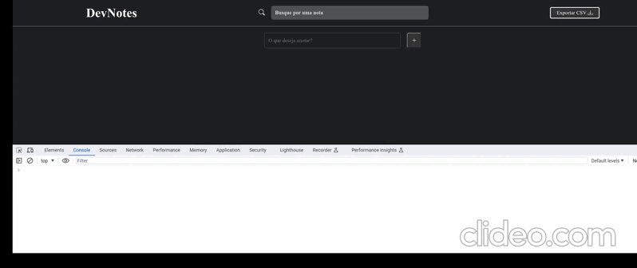
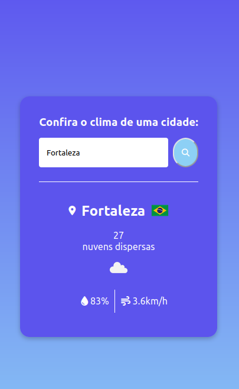
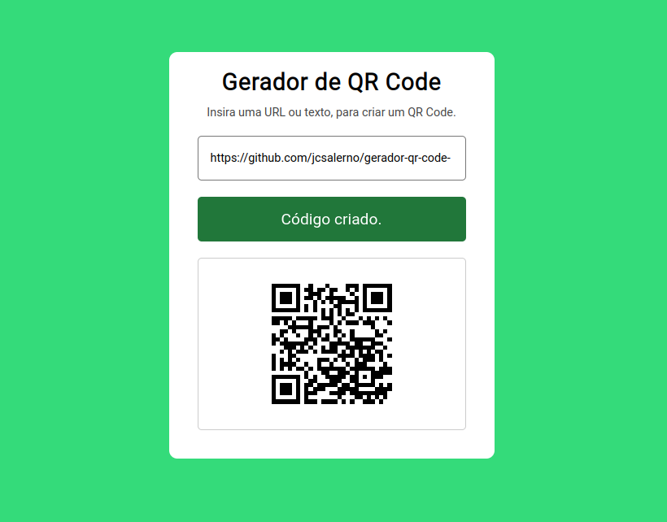

# Portfólio de Julio Cesar

Bem-vindo ao meu portfólio! Aqui você encontrará informações sobre mim e alguns dos meus projetos. Continue rolando para explorar.

## Conteúdo

1. [Home](#home)
2. [Sobre Mim](#about)
3. [Projetos Recentes](#portfolio)
4. [Contato](#contact)

## Tecnologias Destacadas

Na seção de ícones, destaco algumas das tecnologias com as quais trabalho:

- React
- JavaScript
- Python
- AWS
- Node.js
- CSS3
- HTML5
- E mais...

## Screenshots dos Projetos Recentes

- [Dev Notes](https://github.com/jcsalerno/dev-notes): Aplicação para fazer anotações.

- [Gerador Box Shadow](https://github.com/jcsalerno/gerador-box-shadow): Permite visualizar e personalizar uma sombra.

- [To Do Avançado](https://github.com/jcsalerno/todo-list-avancado): Aplicação web de Lista de Tarefas.

- [Gerador de Senhas](https://github.com/jcsalerno/gerador-senhas): Personalize senhas com várias opções.

- [Aplicativo Clima](https://github.com/jcsalerno/app-clima): Verifique informações de clima de uma cidade do Brasil.

- [QR Code](https://github.com/jcsalerno/gerador-qr-code-): Insira uma URL ou texto e gere um QR Code correspondente.

## Sobre Mim

Atualmente sou estudante de Rede de Computadores na Universidade Federal de Santa Maria (UFSM) e atuo como Analista de Suporte, pesquisando principalmente Full Stack.

## Contato

Fique à vontade para entrar em contato comigo! Use o formulário na seção de Contato ou siga-me nas redes sociais.

- LinkedIn: [Julio Cesar](https://www.linkedin.com/in/juliocesar-developer/)
- GitHub: [jcsalerno](https://github.com/jcsalerno)

Espero que goste do meu trabalho!

## GIF do Portfolio
